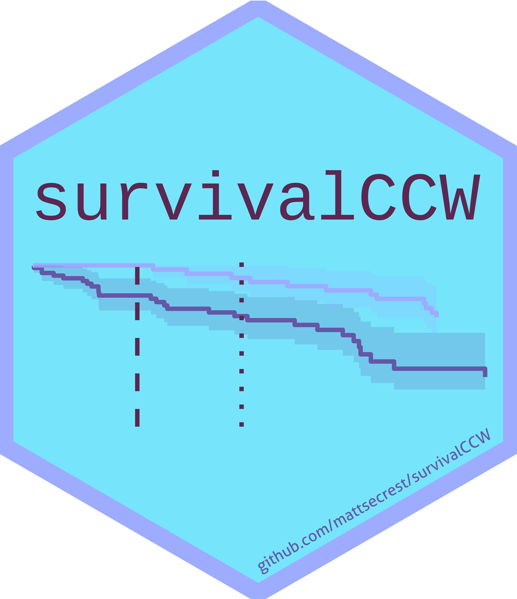

# survivalCCW 

<!-- badges: start -->

[](https://github.com/Genentech/survivalCCW)
[](https://lifecycle.r-lib.org/articles/stages.html#experimental/)

<!-- badges: end -->

This is a light-weight package that helps structure data for clone censor weighting (CCW) analyses of time-to-event endpoints in R.

## Background

Estimating the effect of non-randomized treatments in observational studies can be challenging because a patient’s treatment allocation is often unknown until their treatment strategy is initiated. Using the observed treatment strategy naively often results in immortal time bias, among other biases. Consider, for example, the effect of treatment duration on overall survival. A naive analysis that compares patients who were observed to receive treatment for longer would suffer from immortal time bias because longer treatment duration is related to longer survival. Traditional methods for addressing such bias include landmark analyses, which suffer from selection bias and reduced power, and time-dependent Cox models, which prevent the estimation of absolute risks and lead to less interpretable estimands. Clone censor weighting (CCW) is a robust approach that addresses immortal time bias while maintaining study power and interpretability and allowing for absolute risk estimation.

CCW can be time-consuming to implement, not only because it is a novel method which is unfamiliar to most applied biostatisticians, but also because it involves nuanced data manipulation. All patients are cloned and assigned to either treated or untreated at baseline; they are then cast into “long” follow-up format, with one row for each patient-clone-period combination; finally, inverse probability of censorship weights are calculated for each patient-clone-period.

## {survivalCCW}
To facilitate the easy adoption of CCW and provide a standard approach, we introduce {survivalCCW}, a light-weight, open-source R package designed to streamline the process of performing survival analyses using CCW. The package provides functions to format data, calculate weights (using the baseline hazard approach; Gaber 2024), and perform survival analyses with ease. The workflow of {survivalCCW} is intuitive and user-friendly, facilitating rapid data manipulation and inference. 

An illustrative example is shown below. {survivalCCW} additionally contains vignettes that show how to bootstrap confidence intervals within the context of the CCW. 

```
df |>
  create_clones(
    id = 'id',
    event = 'event',
    time_to_event = 'timetoevent',
    exposure = 'exposure',
    time_to_exposure = 'timetoexposure',
    ced_window = 100
  ) |>
  cast_clones_to_long() |>
  generate_ccw(c('cov1', 'cov2'))
```

As an open-source package maintained by the Roche Statistical Engineering team, {survivalCCW} is validated, tested, and continually improving. Interested users can find {survivalCCW} on CRAN or the Genentech Github: github.com/Genentech/survivalCCW. The tutorial can be found [here](https://genentech.github.io/survivalCCW/articles/conduct-ccw-analysis.html).

## Bug reports
Please report any issues or bugs [here](https://github.com/Genentech/survivalCCW/issues/).

## References
Gaber, Charles E., et al. "The Clone-Censor-Weight Method in Pharmacoepidemiologic Research: Foundations and Methodological Implementation." Current Epidemiology Reports (2024): 1-11.